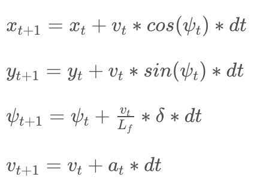
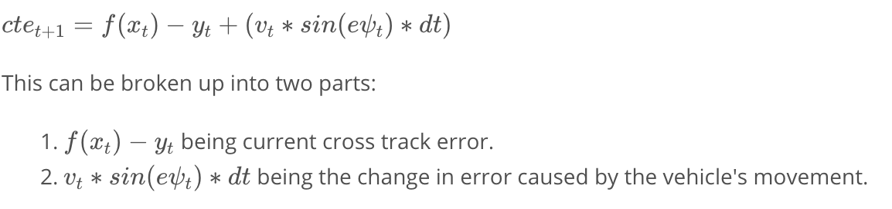
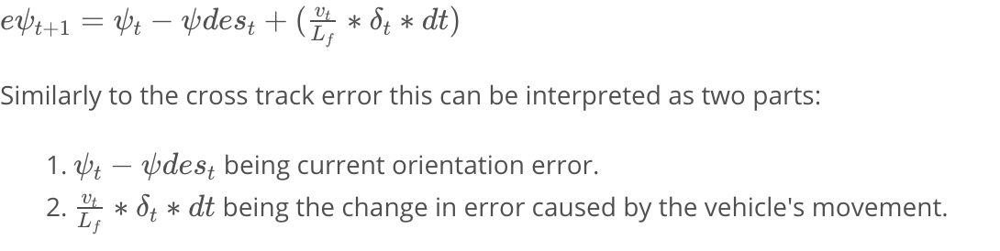

# Term2 - Project 5: Model Predictive Control
### Ajay Paidi

# Objective
The objective of this project is to implement a Model Predictive Controller (MPC) to control the movement of a virtual car in the Udacity simulator.

# File structure
- **ReadMe.md**: This file
- **main.cpp**: The main executable program that calls the MPC to get a steering value and throttle value and communicates with the virtual car in the simulator using uwebsockets.
- **MPC.h** and **MPC.cpp**: Contains the implementation of the Model Predictive Controller.

# Description

The following are the ingredients that help to realize a successful MPC
1. Vehicle model.
2. Cost function.
3. Solver.

### Vehicle Model
In this implementation of MPC a simple kinematic model is assumed to approximate the vehicle dynamics. The state of this model is as follows

``[x_position, y_position, orientation, velocity, cross track error, orientation error]``.

The cross track error (CTE) is the distance between the predicted vehicle position and the reference (planned) trajectory. Similarly the orientation error is the difference between the predicted orientation of the vehicle and the planned orientation.

The actuators used to control the state are ``[steering angle, acceleration]``.
The acceleration actuator controls both the throttle (max throttle +1) and brake (max brake -1).

The update equations governing the change of state over time is as follows

#### Polynomial fit
The path planning module typically returns 'waypoints' of the planned path ahead. In order to use this information in the solver to compute the predicted path, one needs to fit a polynomial to the waypoints. The polynomial coefficients can then be used to compute the error update equations for CTE and orientation error.

The CTE update  equation is

The polynomial co-efficients are used to compute f(x_t).

The orientation error update equation is

psi_dest can be obtained by computing the arctan(derivative of f(xt)).

### Cost function
The MPC arrives at the desired actuator values by minimizing a cost function between the desired/planned trajectory and predicted trajectory (using the update equations for the vehicle model). I used the following cost function in my implementation

cost = A * cte_t1^2 +  B * epsi_t1^2 + C * (v_t1 - ref_v)^2 + D * delta_t1^2 + E * acc^2 + F * (delta_t1 - delta_t0)^2 + G * (acc_t1 - acc_t0)^2

Here A,B,C,D,E,F,G are weights used to tune the desired strength of the corresponding term.

CTE - Cross track error

epsi - Orientation error

v and ref_v - velocity and reference velocity

delta - Steering angle

acc - acceleration

### Solver
The solver or the optimizer is the key ingredient of the MPC that optimizes the actuator inputs and outputs a vector of actuator values that minimizes the cost function for every time step t. The length of the output vector is the same as the number of samples in the prediction time horizon T = N * dt. N is the number of time samples and dt is the interval between time samples. N and dt are hyperparameters that need to be tuned. I used a prediction horizon of 1 second (N=10 and dt=0.1). I arrived at these values mostly by manually tuning them.

The solver used in this implementation is an open source solver called Ipopt. An important step in using Ipopt is setting the appropriate variable bounds and model constraints. The variable bounds are the upper and lower bounds for each of the variables in the vehicle state vector and actuator inputs. The model constraints are set up to minimize the difference between the predicted state values and computed state values. In a sense they can be thought of as add-ons on top of the cost function. So for example, if x_t1 is the computed x state of the solver after minimizing the cost function, then the model constraint to be minimized is x_t1 - x_t1_predicted. x_t1_predicted can be calculated from the vehicle model update equations.

## MPC algorithm
A rough pseudocode of the MPC algorithm looks like this

Setup:
- Define the length of the trajectory, N, and duration of each timestep, dt.
- Define vehicle dynamics and actuator limitations along with other constraints.
- Define the cost function.

Loop:
- We pass the current state as the initial state to the model predictive controller.
- We call the optimization solver. Given the initial state, the solver will return the vector of control inputs that minimizes the cost function.
- We apply the first control input to the vehicle.
- Back to 1.

## Latency
One big advantage of MPC (over say PID controller) is its ability to model in latency. Latency refers to the delay between sending an actuator signal and applying the actuator signal. The Udacity simulator simulates a latency of 100 ms. Latency is handled by modeling the delay into the input state. If the simulator gives the current state of the vehicle at time t, one can apply the vehicle model update equations to estimate the state at time t+l_dt where l_dt is the latency time. The MPC solver then computes the optimized actuator values at time t+l_dt (instead of time t).

# Results

Here is a video of the MPC controller in action with the reference velocity set to 65 mph. The car succesfully completes few laps around the track even wth the reference velocity set to 100 mph (peak speed of 95 mph was observed in the simulator). However the performance is also dependent on the hardware. My simulator was run on a mabook pro (core i5 2.6 GHz 4 MB RAM).

# References

Starter code provided by Udacity and videos/lecture notes.
